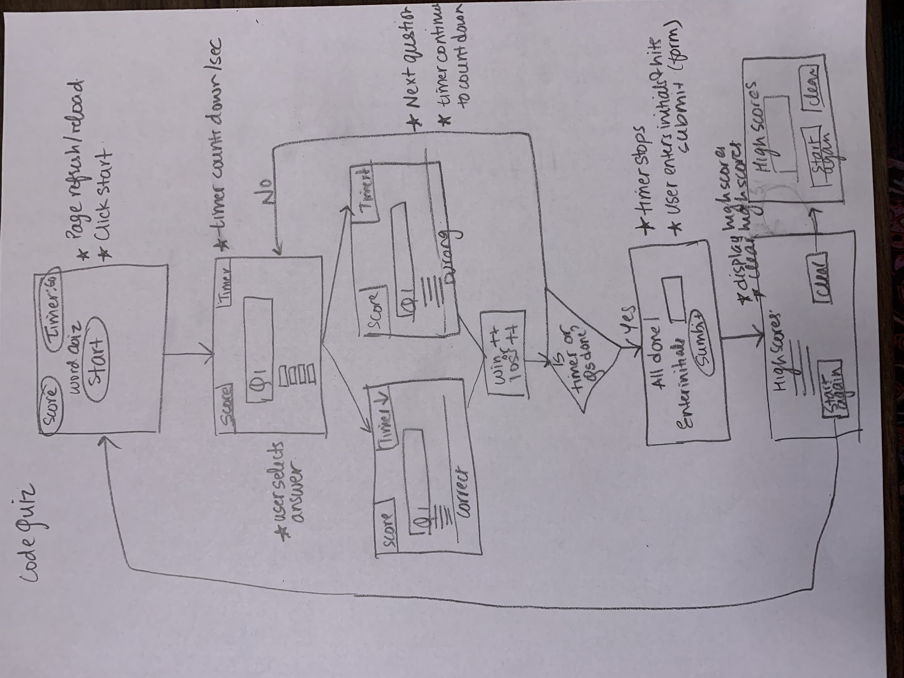

# Code-Quiz

## Description: 
In this Quiz game, a user will be presented with questions related to coding.! The following criteria must be met.

* I can click a start button to enter quiz and start timer (counts down)
* I can answer a question, get feedback on whether I was right or wrong, start next question
* If answer is incorrect, time is subsctracted from clock
* Game ends when time = 0 or all questions are answered
* I have ability to save my initials and my score
* I have ability to access high scroes

## Link to Application:
https://bkhandag.github.io/Code-Quiz/

## Wireframe:

## Pseudo Code:
* Identify events
    - Page load
    - hitting start button
    - timer counting down every second
    - answer button click (let user know if correct or not, if not reduce time)
    - upon selecting answers, show next question
    - save score with intials
    - view high scores
    - start code quiz again
* Write event handlers using CSS selector
* addeventListerners
    - When page is loaded, show a code quiz header and a button to start quiz
    - When start button is hit, timer starts counting down, first question is displayed
    - When user selects answer to question, feedback is provided, timer is reduced for wrong answer
    - Right and Wrong answers are tracked for scorekeeping
    - A new question is displayed
    - This continues until timer runs out or all questions are displayed
    - Score is saved by user by adding initials
    - Highscores can be viewed after the game ends
    - Game can be restarted from high score page.
* Declare global (which event handlers will be tracked through out the program?) and state variables

### Logic:
1. Initialize timer.
1. Create objects with questions, answers, correct answer
1. While timer is counting down, first question is displayed with options
1. Upon user selection of one option, right or wrong feedback is displayed, timer reduced for wrong answer
1. All correct and wrong answer counters tracked
1. When timer = 0 or all questions have been asked, user prompted to save scores with initals
1. user accesses high scores
1. user can restart the game.

## Screenshot

References:
https://simplestepscode.com/javascript-quiz-tutorial/
